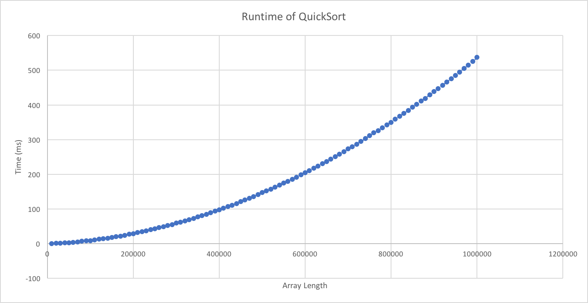

# JoeJerrieChowder(Jerry Ye, Raunak Chowdhury, Jude Grodesky): Analyzing the runtime of QuickSort
  JoeJerrieChowder -- Jerry Ye, Raunak Chowdhury, Jude Grodesky
  APCS2 PD02  
  Lab01 -- But What Does the Data Say?   
  2018-03-14
### Hypothesis
For an array of size n, the QuickSort algorithm will run in O(nlogn) time on average and in the best case. It will run at a time of O(n^2) in the worst case. 
### Background
The QuickSort algorithm's runtime is O(nlogn) in the best and average case, but O(n^2) in the worst case. At worst, if you continously select the maximum or minimum as the pivot, QuickSort will run in O(n^2) run time because you are performing partition (a linear run time method) n times resulting in a O(n^2) runtime categorization. Alternatively, in the best case, you would select the median of the array everytime which would mean that you perform partition logn times exactly. On average, you would still perform partition less times than n so the average case is O(nlogn) as well. 
### Experiment methodology
1. Run 1000 trials of each array size in the interval [10000,1000000], in intervals of 10000.
2.To run a trial, you build an array with random values, and then call quicksort on it. The start time is taken in between the bulding of the array and sorting, and the end time is taken after the array is sorted. The endtime and startTime are subtracted to find the time.
3. Average the difference of the startTime and endTime to get the average runtime.
4. Print to the CSV.
### Graph

### Conclusion
The data shows a linear-logarithmic relationship between array length and runtime. The rate of change of the runtime increases as the arraysize increases. The difference between runtimes begins as one milisecond, then rapidly increases. However, as it increases, it takes a larger shift in arraysize to cause the same shift in "runtime rate of change".
